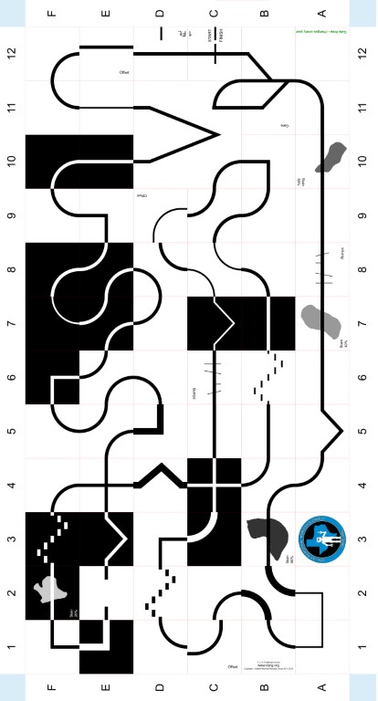

### Library 1.4 released see LFS-1.4-Changes.pdf (doc to be posted)

More cool new features including interactive parameter editor, improved sketch organization, clearly defined 
user display panels, better help with user help screen, separation of custom key decoding from LFS key decoding,
best of all demo animation for destruction of your robot when it strays beyond course bounds. 

The updated LFS_Simplebot sketch includes most of the updates. Just a few additions to the library code.

You will need the Processing sound library for this release. On processing menu bar Sketch > Import Library > Add Library
will invoke the Contribution Manager, type sound in the search box then click on Sound library then click Install button.
When the installation is complete, restart Processing and you should be good to go.

### Library 1.3 released see LFS-1.3-Changes.pdf 
Cool new features including interactive start location and heading Markers, User colorable sensors, Hover over sensors to identify, improved viewport display with course and robot OR sensor view.

### Library 1.3.1

Optional robot icon overlay. See LFS_Simplebot  UserInit tab userInit method. 
Within a few hours of release, corrected problem with sensor viewport outline being displayed over top of course view when loading large robot icon. Fixed - did not increment
library version. Re-download and overwrite..  

# LFS - Line Follower Simulation 
LFS is a software tool designed assist in the process of desinging robot line follower controller software.

LFS let's you quickly prototype different controller ideas, with different robot configurations, and develop insight to how they might behave on different line following courses. By the time LFS was first published on GitHub in August 2020, it had already been used to experiment and improve on sensor placement and controller algorithms for the baseline Tricycle Controller included in this repo. 

LFS utilizes the Processing environment which is availble for download at www.processing.org. LFS is built into a procesing library which includes core code and example Processing sketches included here. 

  
This software was developed in context of the Dallas Personal Robotics Group (DPRG). Learn more about DPRG at https://www.dprg.org/. Check out DPRG's extensive You Tube library https://www.youtube.com/user/DPRGclips.

 
Check out various DPRG line following courses at https://github.com/dprg/Contests/tree/master/Line%20Following. 

Shown below is an image of the DPRG Challenge Course. Join in and create your controller to solve this course! 

  

### LineFollowerSim (LFS) Installation

Download Processing 3.4 or later from the Processing website at www.processing.org.
If you are new to processing, follow their instructions to gain some basic knowledge of the environment which is very similar to Arduino IDE, except Processing is Java based. If you have C++ programming experience, fear not, Java uses many identical low level language constructs reducing the learning curve. Also, you don't need to be a Java expert to get a great deal of milage out of the Processing environment.

Download latest lineFollowerSim-X.zip (where X is release number) found nested a few levels down in above distribution folder.
Click on lineFollowerSim-X folder then its download folder where you will find lineFollowerSim.zip. Click on the file and you will find a Download button on the 
right side of the screen. When you click that button you will see a familiar Open/Save dialog, press OK. After the ZIP is downloaded, extract the lineFollowerSim folder 
and copy folder to to Processing sketchbook folders libraries subfolder.
To locate your processing sketchbook folder: Use Processing menu command  File>Preferences to display Preferences dilog. The sketchbook path is listed in the dialog as the
first item. If the libraries folder does not exist in your sketches folder, you will need to create it, then copy LineFollowerSim folder to it.

  
Start/Restart Processing  File>Examples  you will find Two example sketches when expanding tree branch named Line Following Simulator.

The LFS Application Interface as used by the included example sketches, is documented in the reference subfolder of the LineFollowerSim library folder. Click on index.html and the API documentation will appear in your browser.

 
Also, download the User's guide from the file list above. Available in PDF or ODT (Open Desk Top ) document format.

See also API documentation located in reference subfolder of lineFollowerSim-X folder. (Clicking on index.html to load HTML based API documentation. 

### Known Issues 1.3.0 (+ indicates corrected in next release, - pending)

+ If you "Finish" a contest with sensor view display vs course, the snapshot will contain that view and not the course. To correct with auto display of course view.

Modify UserKey adding courseTop=true;     if (key == 'F')  {courseTop=true; lfs.contestFinish();}               

 
+LFS contest runtime reported as mins:sec:millisec vs  mins:sec.millisec in contest.cdf file (located in sketch data sub folder)

Happy line following!

