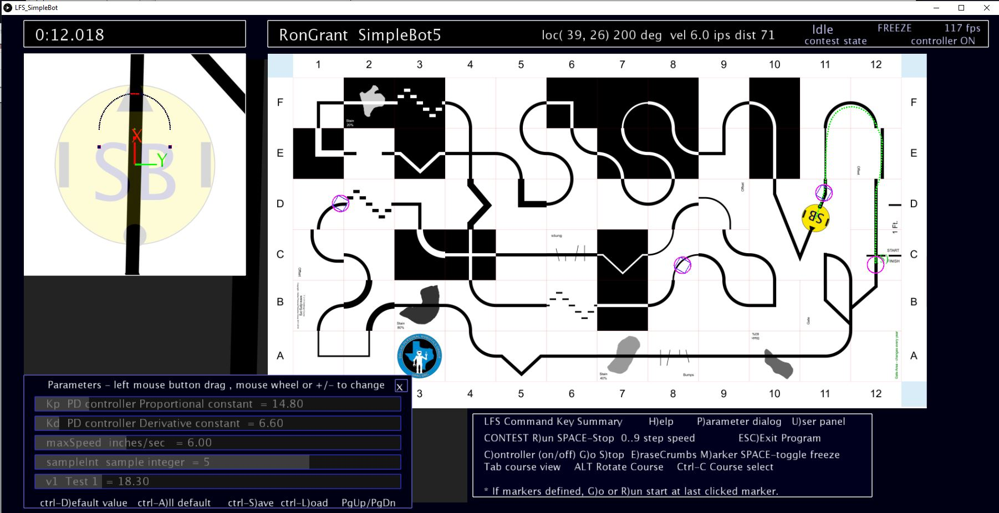

### Library 1.6.4

Line/Half-Circle sensor rotation problem fixed. Thanks Chris Netter for pointing out (1.6.4)
Improved double buffer cookie crumbs logic  Loop+TimeWarp,  reduced/eliminated residule crumbs...
Set explode on out of bounds to false (in most demos - check LFS_G make sure false).

Added LFS_2Spot demo. Very simple 2 spot sensor demo with a few automated steps on dimming course for looped timewarp (1.6.3)

Carl Ott - Spotted Misplaced assignment (Zeroing D term in PD controller)  in SimpleBot Mecanum demos.
Also MecanumDemo missing LFS_G.pde file.  (couple of quick fixes for 1.6.2)

Revised User's Guide Released,   LFS Users Guide 1.6 

Fixed course change wrong image in robot view. (Texture map not updated on GPU was the problem).

Added GoMarker button (thanks Will Kuhnle for suggesting). Robot runs from start position at warp speed, then
drops out of warp and freezes near marker with all run state information in tact. This feature eliminates need for
the saved robot state marker system and the effort on the part of user to add robot state variables to Robot State
class.

Fixed a number of contest run problems including lap contest auto end not allowing report or cancel. 

Made Parameter Editor slider scale match slider length. 

### Library 1.6 

TimeWarp!!! (run 100X + faster simulation)

Loop  GUI-Buttons/Checkboxes (with most functionality except 0..9)  Also Switch to Improved Key Cmd Menu.

New Tab LFS_G,  Top of tab has a few constants + sound file names, rest is GUI button/command defs.

UMisc cleaned up - only user code & demo user buttons.

UPar TimeWarp control and robot opacity control (4 lines of code added).

 
Some documentation may follow, buttons are buttons, and they all have hover hints.

### Library 1.5.2 released

New User's Guide 1.5 (PDF Available)
Parameter Editor Ctrl-A, repaired & improved mouse button pressed logic preventing select when drifting off item.

New ability for controller to notify simulator it does not need sensor data update for next step.
This can speed up simulation execution rate while not affecting robot "run time".

1.5.2 Added setCrumbThresholdDist to UserInit - allows for spacing cookie crumbs out a bit to speed simulator on long
course runs. Also eliminated some dynamic (heap) alloocated vars. when drawing sensor/robot views, lowering frequency of garbage collection that can 
cause frame rate reduction.  

Also, Q)uietDisplay command to hide panels to speed frame rate for faster simulation runs. (lib 1.5.1)

See other release notes at end of README.

# LFS - Line Follower Simulation 
LFS is a software tool designed assist in the process of desinging robot line follower controller software.

LFS let's you quickly prototype different controller ideas, with different robot configurations, and develop insight to how they might behave on different line following courses. By the time LFS was first published on GitHub in August 2020, it had already been used to experiment and improve on sensor placement and controller algorithms for the baseline Tricycle Controller included in this repo. 

LFS utilizes the Processing environment which is availble for download at www.processing.org. LFS is built into a procesing library which includes core code and example Processing sketches included here. 

  
This software was developed in context of the Dallas Personal Robotics Group (DPRG). Learn more about DPRG at https://www.dprg.org/. Check out DPRG's extensive You Tube library https://www.youtube.com/user/DPRGclips.

 
Check out various DPRG line following courses at https://github.com/dprg/Contests/tree/master/Line%20Following. 

Shown below is an image of the DPRG Challenge Course. Join in and create your controller to solve this course! 

  

### LineFollowerSim (LFS) Installation

Download Processing 3.4 or later from the Processing website at www.processing.org.
If you are new to processing, follow their instructions to gain some basic knowledge of the environment which is very similar to Arduino IDE, except Processing is Java based. If you have C++ programming experience, fear not, Java uses many identical low level language constructs reducing the learning curve. Also, you don't need to be a Java expert to get a great deal of milage out of the Processing environment.

Download latest lineFollowerSim-X.zip (where X is release number) found nested a few levels down in above distribution folder.
Click on lineFollowerSim-X folder then its download folder where you will find lineFollowerSim.zip. Click on the file and you will find a Download button on the 
right side of the screen. When you click that button you will see a familiar Open/Save dialog, press OK. After the ZIP is downloaded, extract the lineFollowerSim folder 
and copy folder to to Processing sketchbook folders libraries subfolder.
To locate your processing sketchbook folder: Use Processing menu command  File>Preferences to display Preferences dilog. The sketchbook path is listed in the dialog as the
first item. If the libraries folder does not exist in your sketches folder, you will need to create it, then copy LineFollowerSim folder to it.

  
Start/Restart Processing  File>Examples  you will find Two example sketches when expanding tree branch named Line Following Simulator.

The LFS Application Interface as used by the included example sketches, is documented in the reference subfolder of the LineFollowerSim library folder. Click on index.html and the API documentation will appear in your browser.

 
Also, download the User's guide from the file list above. Available in PDF or ODT (Open Desk Top ) document format.

See also API documentation located in reference subfolder of lineFollowerSim-X folder. (Clicking on index.html to load HTML based API documentation. 

Happy line following!

### Releases 

### Library 1.5.1 and Demo Apps. released 

See top of readme.

### Library 1.4.2 released

Cleanup no new features except:

Auto robot icon generation available with your initials and favorite colors.

Improved fool proof contest run, that prompts for F)inish and report or X cancel in modal fashion (not allowing other commands). Also, lap beep added. Decided to make sound library addition manditory.

Auto lap timer really works now, run N laps and stop. On Finish, total time written to contest.cdf and each lap time. 

Controller status, delta step rate displayed.

Next release with only have bug fixes!  

No release manual yet, but lots of internal comments added to program, and to javadocs.

### Library 1.4.1 released, doing some round up of minor bugs and testing over next few days.

Features

Automatic lap timer for N laps, stopping on last. calculates closest distance to start point less than 3 inch maximum
distance. Added a tiny course for quick trial of lap timer.

Course list added to UserInit, including ability to select initial course. Also added Ctrl-C cycle through listed courses.

Multi-page help includes simulator imposed maximum values for speed/acceleration turn rate/turn acceleration.

Distance measured for run, and can be included in report (See UserInit). 

Problems reported by Chris N, regarding mouse/keyboard able to make changes to parameters that did not have focus.

Problem reported by Chirs N, intensity reported wrong on sensors. Removed old code that colored pixels after read.
Side-Effect is great speed boost of frame rate (about 50% in my case) due to CPU<->GPU frame buffer transfer overhead reduction.

Working On:

Ability to read distance traveled after run to allow for run automation, trying different parameters... 

Looking for bugs.. Still don't have 1.4 changes doc ready... 

### Library 1.4 released see LFS-1.4-Changes.pdf (doc to be posted)

More cool new features including interactive parameter editor, improved sketch organization, clearly defined 
user display panels, better help with user help screen, separation of custom key decoding from LFS key decoding,
best of all demo animation for destruction of your robot when it strays beyond course bounds. 

The updated LFS_Simplebot sketch includes most of the updates. Just a few additions to the library code.

You will need the Processing sound library for this release. On processing menu bar Sketch > Import Library > Add Library
will invoke the Contribution Manager, type sound in the search box then click on Sound library then click Install button.
When the installation is complete, restart Processing and you should be good to go.

### Library 1.3 released see LFS-1.3-Changes.pdf 
Cool new features including interactive start location and heading Markers, User colorable sensors, Hover over sensors to identify, improved viewport display with course and robot OR sensor view.

### Library 1.3.1

Optional robot icon overlay. See LFS_Simplebot  UserInit tab userInit method. 
Within a few hours of release, corrected problem with sensor viewport outline being displayed over top of course view when loading large robot icon. Fixed - did not increment
library version. Re-download and overwrite..  

### Known Issues 1.3.0 (+ indicates corrected in next release, - pending)

+ If you "Finish" a contest with sensor view display vs course, the snapshot will contain that view and not the course. To correct with auto display of course view.

Modify UserKey adding courseTop=true;     if (key == 'F')  {courseTop=true; lfs.contestFinish();}               

 
+LFS contest runtime reported as mins:sec:millisec vs  mins:sec.millisec in contest.cdf file (located in sketch data sub folder)

